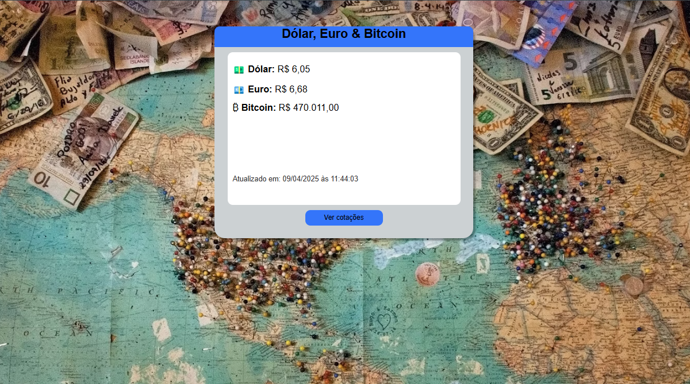

# 💱 Cotação em Tempo Real - Euro, Dólar e Bitcoin

Um site simples feito com **HTML**, **CSS** e **JavaScript** que exibe a **cotação atual do Euro (EUR), Dólar (USD) e Bitcoin (BTC)** em relação ao Real (BRL), utilizando a [AwesomeAPI](https://docs.awesomeapi.com.br/api-de-moedas).

> 📉 O projeto surgiu como uma alternativa prática e leve para consultar cotações de moedas, já que o Google deixou de exibir os gráficos de câmbio diretamente nos resultados de pesquisa.

---

## 🔗 Acesse o site

👉 [Clique aqui para ver online]([https://lucasnjr.github.io/Cotacao-Moedas/])

---

## 📸 Preview

---

## 🔍 Funcionalidade

- 💶 Consulta em tempo real das moedas: **Euro**, **Dólar** e **Bitcoin**.

---

## 🛠️ Tecnologias Utilizadas

- **HTML5**
- **CSS3**
- **JavaScript (Vanilla JS)**
- [**AwesomeAPI - API de Moedas**](https://docs.awesomeapi.com.br/api-de-moedas)
